# Bài tập: Sử dụng Git

Tài khoản: **dtc225201515-cloud**. Ngày thực hành: **03/10/2026**.

## Repository và cách xem bài

- Bài 1–5: https://github.com/dtc225201515-cloud/git-basic-practice
- Bài 6 (tổng hợp): https://github.com/dtc225201515-cloud/personal-introduction
- Minh chứng: thư mục `evidence/` trong repository này. Các file TXT chứa output Git thực tế; các ảnh JPG là ảnh chụp trang hiển thị nguyên văn những output đó, không phải ảnh chụp ứng dụng terminal.
- Bản lưu trên máy: `D:\CodeGym\git-basic-practice`, `D:\CodeGym\personal-introduction`, `D:\CodeGym\git-basic-practice-clone`, `D:\CodeGym\git-evidence`.

## Bài 1 — Khởi tạo và commit đầu tiên

Chạy `git init -b main`, tạo `index.html`, `style.css`, `notes.txt`; chạy `git status` để thấy cả ba file untracked. Sau `git add index.html style.css`, chỉ HTML và CSS ở staging area. Commit đầu tiên có message `Initial commit: add html and css`; `notes.txt` vẫn untracked.

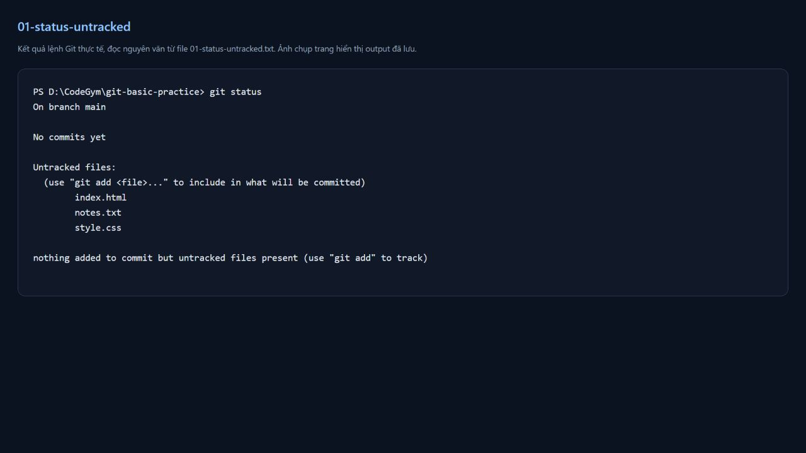
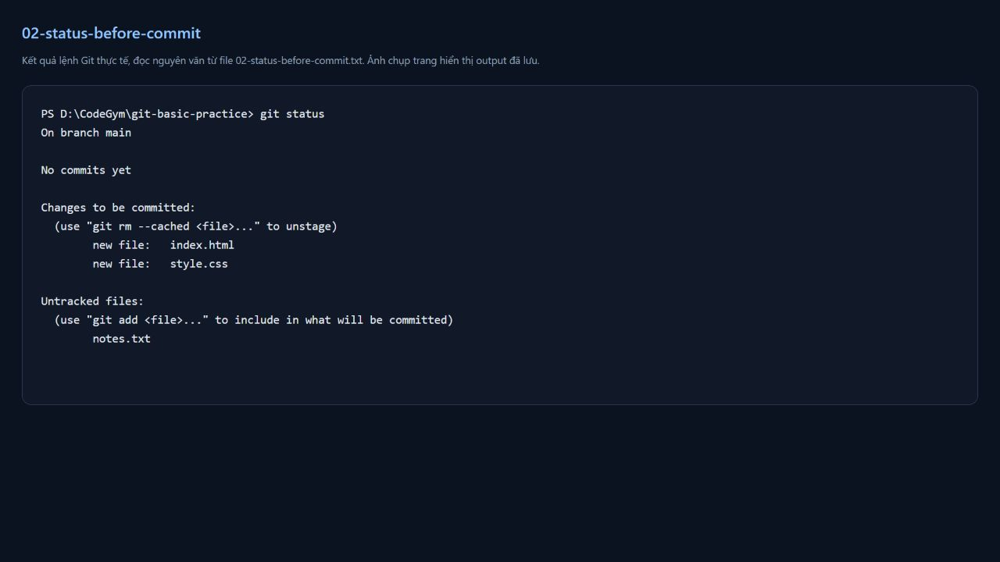
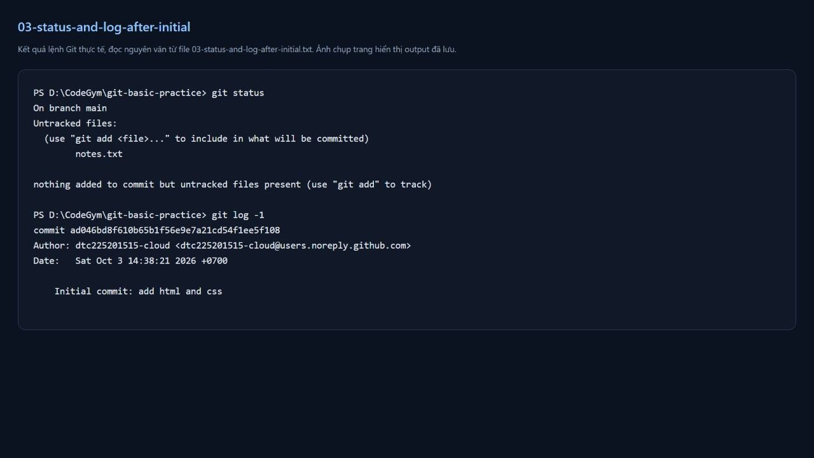

**Vai trò staging area:** Index là vùng chuẩn bị, chứa phiên bản nội dung sẽ được đưa vào commit kế tiếp. Nó cho phép chọn file hoặc từng phần thay đổi để tạo commit tập trung, trong khi giữ các thay đổi chưa sẵn sàng ở working directory. Nếu thiếu vùng này, việc gom các thay đổi liên quan và loại các thay đổi thử nghiệm khỏi commit sẽ bất tiện hơn.

## Bài 2 — Nhiều commit và lịch sử

Đã sửa HTML; tạo JavaScript; rồi cập nhật CSS và đưa notes.txt vào quản lý cùng một commit. Bốn commit đúng thứ tự thời gian:

1. `ad046bd` — Initial commit: add html and css
2. `2fbc88d` — Update html content
3. `dd27427` — Add javascript file
4. `c8bde3c` — Update style and notes

`git log --oneline` hiển thị mới nhất trước. `git show --format=fuller HEAD` hiển thị diff của commit thứ tư.

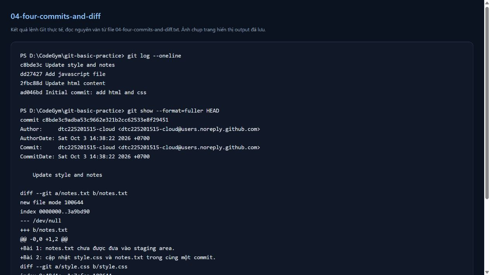
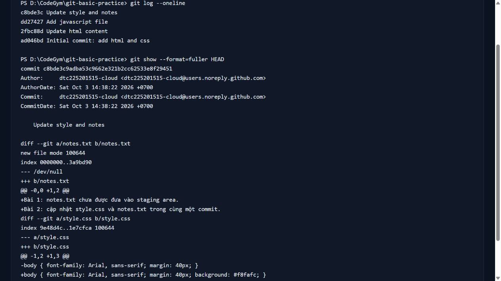

## Bài 3 — Checkout và reset

Checkout commit `dd27427` (Add javascript file): HEAD ở trạng thái detached; script.js tồn tại, chứa lệnh console.log. notes.txt không tồn tại ở phiên bản đó vì file chỉ được commit ở commit tiếp theo. Sau đó dùng `git checkout main` để quay lại.

Đề gọi Add javascript file là "commit thứ 2"; đây là commit thứ ba theo thứ tự tạo, nhưng là dòng thứ hai của `git log --oneline` khi có bốn commit. Bài thực hành chọn đúng message mà đề chỉ định.

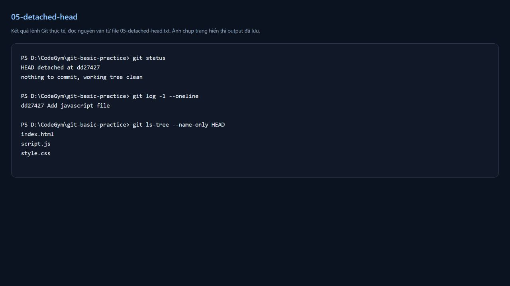
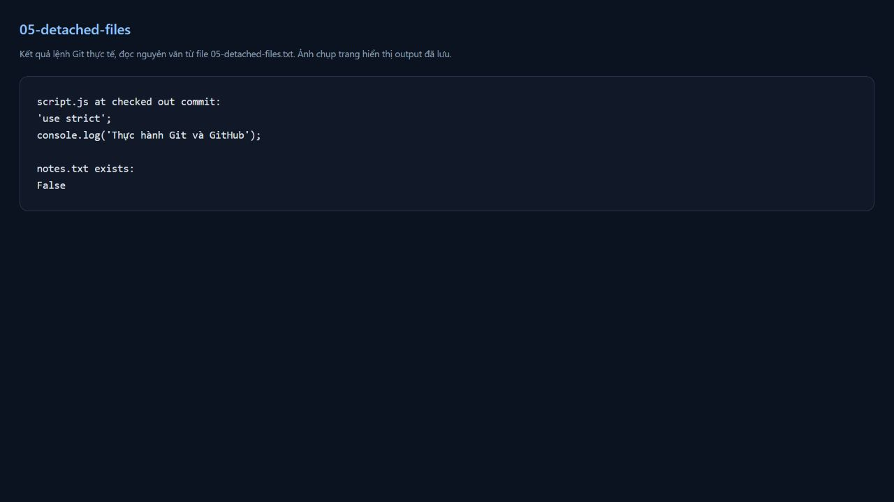

Tạo temp.txt và commit test, rồi chạy từng reset; sau soft commit lại, sau mixed add và commit lại trước khi thử hard.

| Loại reset | Repository / HEAD | Staging area (Index) | Working directory | temp.txt trong bài |
|---|---|---|---|---|
| `git reset --soft HEAD~1` | Lùi một commit | Giữ nguyên | Giữ nguyên | Còn file; staged, sẵn sàng commit lại |
| `git reset --mixed HEAD~1` | Lùi một commit | Khớp commit đích | Giữ nguyên | Còn file; untracked vì commit đích chưa quản lý file này; phải add lại |
| `git reset --hard HEAD~1` | Lùi một commit | Khớp commit đích | Khôi phục file được quản lý về commit đích | temp.txt bị xóa; working tree sạch |

Với file đã được quản lý từ trước, mixed thường để thay đổi thành unstaged, thay vì untracked. Hard không phải lệnh xóa mọi file untracked; tình huống temp.txt bị xóa ở đây do file được theo dõi ở commit test và không có trong commit đích.

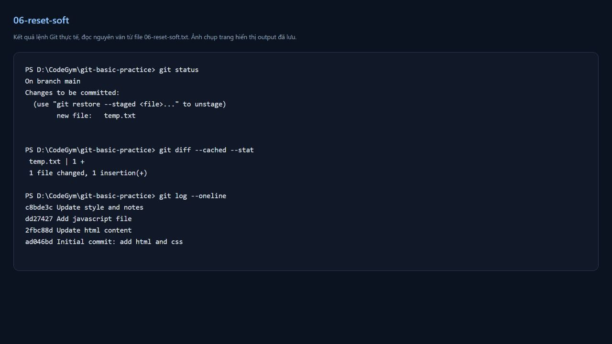
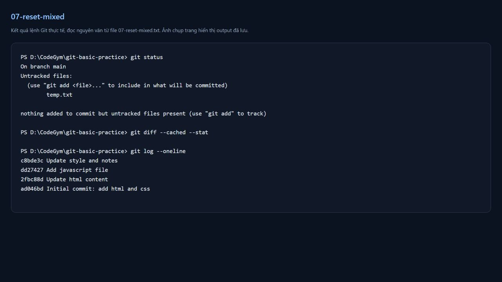
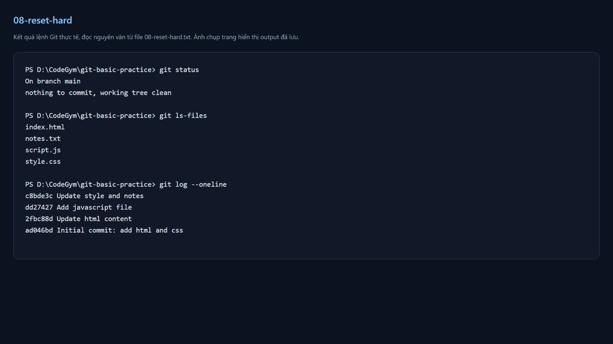

**Đã push cho cả nhóm thì reset --hard để lùi commit có an toàn không?** Reset chỉ thay đổi nhánh local; nó có thể làm mất thay đổi chưa commit. Nếu muốn remote cũng lùi theo thì phải viết lại lịch sử bằng force push, gây lệch lịch sử và ảnh hưởng công việc của người khác. Với lịch sử đã chia sẻ, nên dùng `git revert <hash>` để thêm commit đảo thay đổi và push bình thường. Bài 6 dùng cách này.

## Bài 4 — GitHub và remote

Tạo repository Public `git-basic-practice`, không khởi tạo README trên GitHub. Chạy `git remote add origin https://github.com/dtc225201515-cloud/git-basic-practice.git`, kiểm tra `git remote -v`, rồi `git push -u origin main`. Bốn commit của Bài 1–3 được đẩy lên nguyên vẹn. Các commit test reset không còn trên main đúng mục đích bài thực hành.

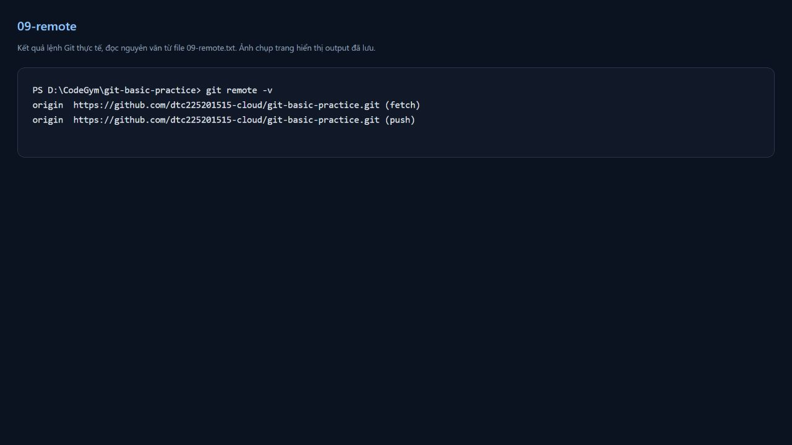

## Bài 5 — Clone, push và pull

Clone repository công khai ở Bài 4 vào thư mục riêng `git-basic-practice-clone`; kiểm tra origin và bốn commit ban đầu. Tạo about.txt ở project chính, commit `Add about file` và push. Sau đó tạo README.md trực tiếp trên giao diện web GitHub, commit `Create README on GitHub for pull practice`, rồi chạy `git pull` ở local. Pull fast-forward và tải README mới về; log local xuất hiện commit `cb2a850`.

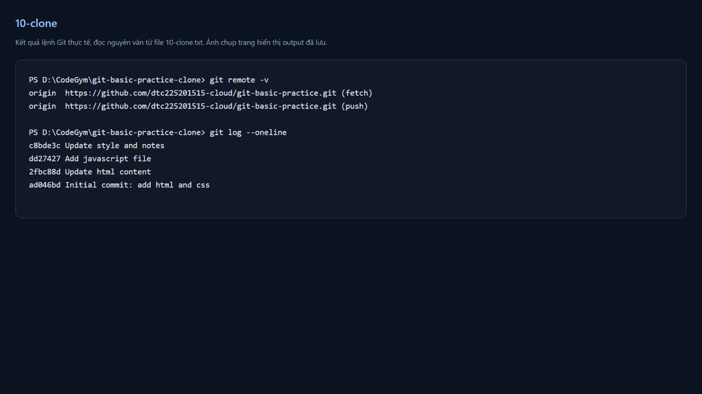
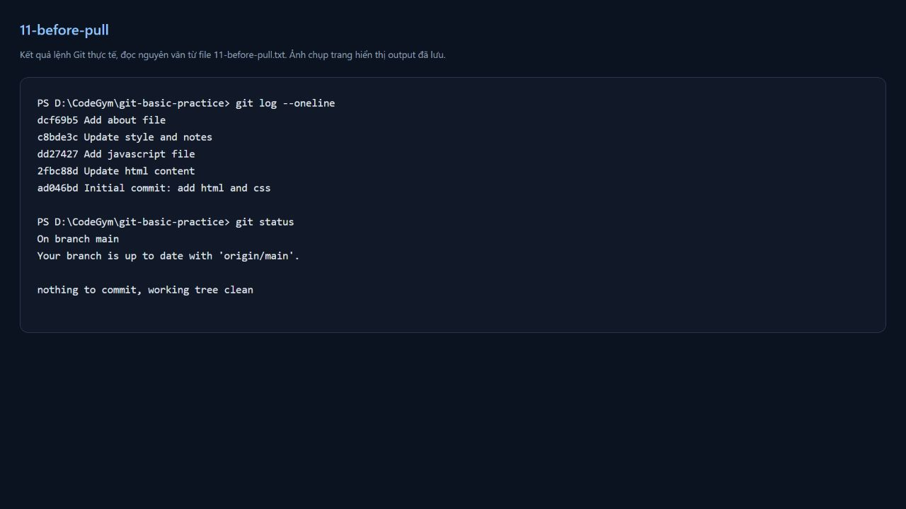
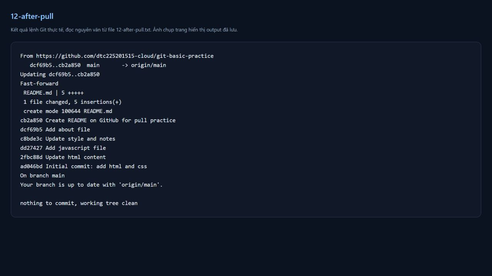

**git pull là tổ hợp hai lệnh nào?** Theo quy trình mặc định của bài này: `git fetch` rồi `git merge` nhánh remote tracking vào nhánh hiện tại. Khi dùng `git pull --rebase` hoặc cấu hình pull.rebase, bước tích hợp là rebase thay cho merge.

## Bài 6 — Trang giới thiệu cá nhân và hoàn tác lỗi

Repository riêng: https://github.com/dtc225201515-cloud/personal-introduction

1. Khởi tạo repo local, tạo HTML/CSS, commit `Initial structure` (`4a06a57`).
2. Tạo repo GitHub; kết nối origin và push đầu tiên, thiết lập upstream main.
3. Thêm phần Giới thiệu bản thân, commit `Add introduction section` (`48509e2`), push.
4. Thêm CSS, commit `Style introduction section` (`454dfb8`), push.
5. Cố tình thêm `.introduction { display: none; }`, commit `Introduce incorrect CSS for revert practice` (`f2893fe`), push để mô phỏng lỗi đã chia sẻ.
6. Chạy `git revert --no-edit f2893fe`, tạo commit `Revert "Introduce incorrect CSS for revert practice"` (`7a77ae6`), push bình thường.
7. Kiểm tra `git diff 454dfb8 HEAD -- index.html style.css`: không có khác biệt, chứng minh nội dung đã trở lại phiên bản đúng và các commit hợp lệ còn nguyên.

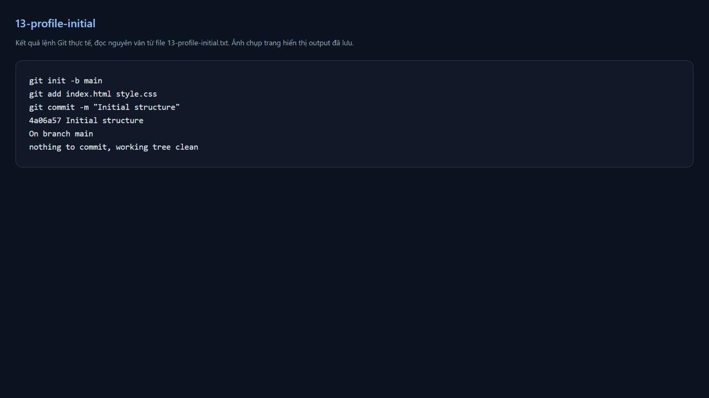
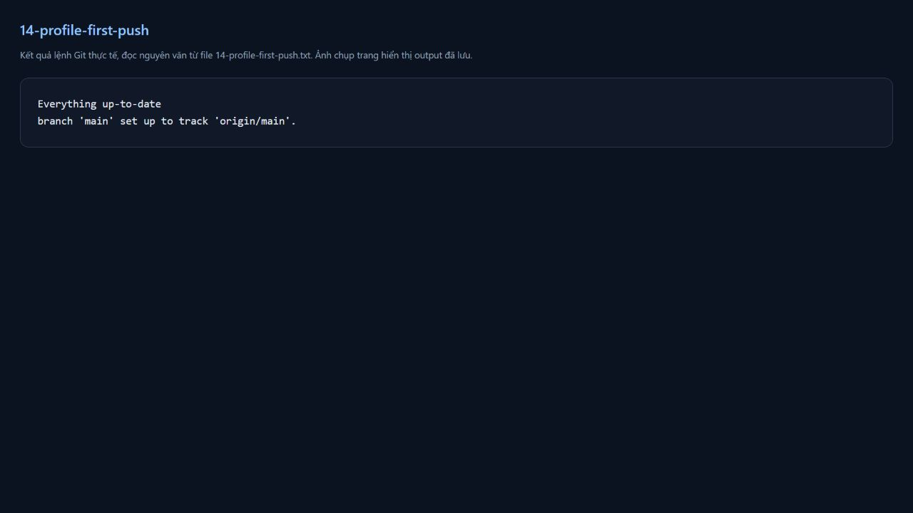
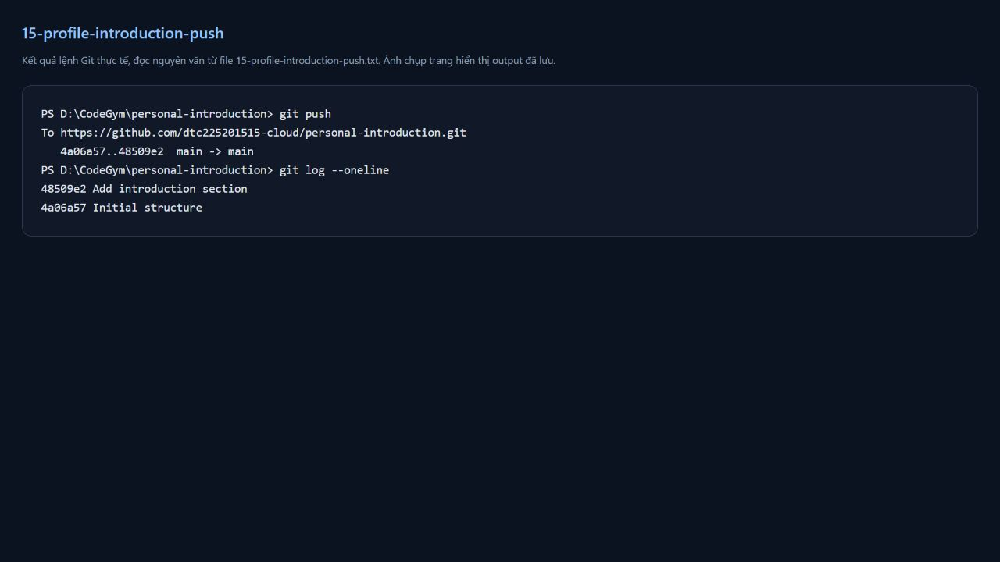
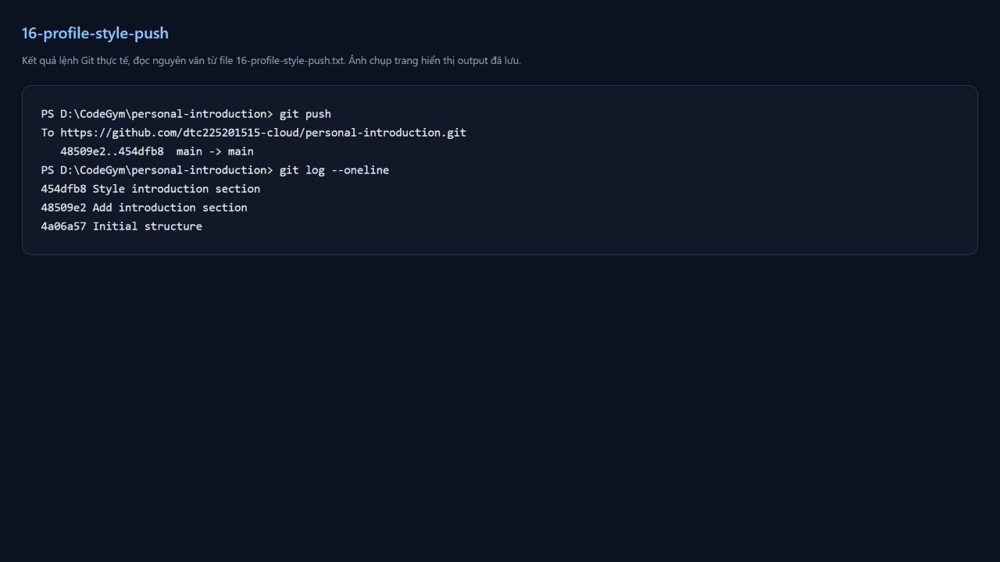
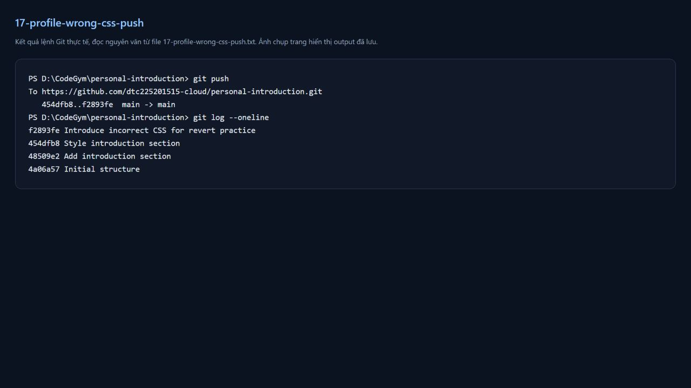
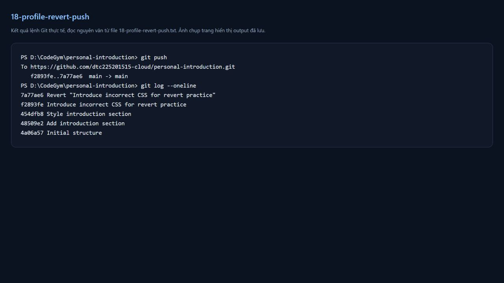
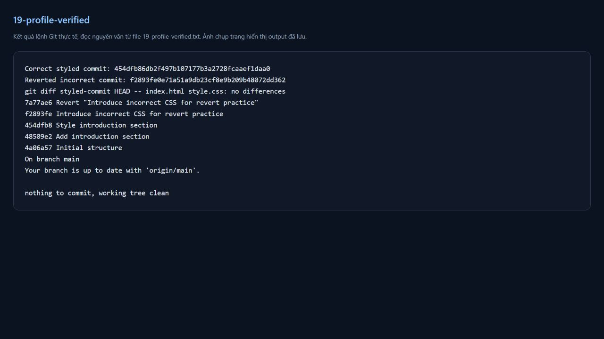

Mở `index.html` ở repo personal-introduction để xem trang. Nội dung dùng tên tài khoản GitHub, không thêm thông tin cá nhân chưa được cung cấp.

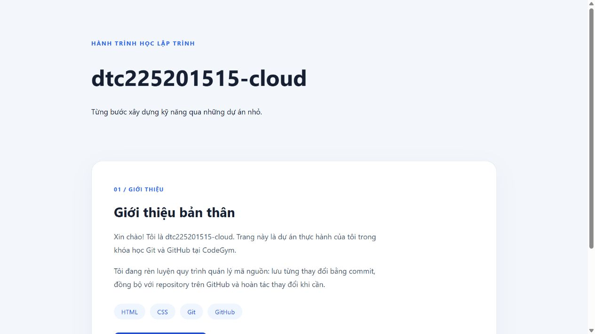
